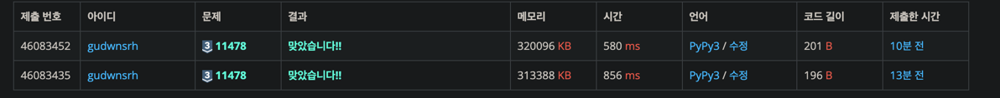

# 서로 다른 부분 문자열의 개수
* [서로 다른 부분 문자열의 개수](https://www.acmicpc.net/problem/11478)

## 1. 문제 설명

abcdw 와 같이 문자열이 주어졌을 때, a,b,c,d,w,ab,cd ... 와 같이 부분 문자열이 몇 개 있는 지 출력하는 문제

## 2. 문제 풀이

* 1~1000(최대값), 1~len(s) 로 2중 for loop 돌아서 풀었다.

## 3. 수확물

### 3-1) 2중 for 돌 때, 문자열 마지막 범위

```
for i <- 1 to 1000:
    for j <- 0 to N-i+1 
        s = iv[j:j+i]
```

* `N-i `가 아니라, `N-i+1` 까지 돌아야 한다.
  * 1일때 생각해봐도, 마지막 값이 포함이 안된다.
  * 파이썬에서는 N이렇게만 해도 알아서 파싱을 해주기 때문에 통과가 되긴 한다.
    * 그러나 속도에서 차이가 많이 난다.

