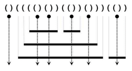

# 쇠막대기

* 실버3
* [쇠막대기](https://www.acmicpc.net/problem/10799)

## 1. 문제 설명

* 처음에 문제가 띠용? 했는데, 간단한 문제다.

* 해당 그림이 설명을 잘해준다.
  * 만약에 ((())) 이런식으로 값이 주어진다면, 파이프 2개에 가운데 레이저가 있어서 파이프 4개가 된다.
  
## 2. 문제 풀이

* 스택을 사용해서 푼다.
  * 괄호가 나온다? -> 스택을 사용한다.

* 아이디어는 `(` 가 나올 때, `(` 가 나왔던 개수만큼 파이프가 잘린 개수가 추가된다는 것이다.
  * 이 때 주의할 점은, 파이프가 닫히는 `)`가 나온다면 마지막에 잘린 조각이 하나 더 생성되기 때문에 +1을 해줘야 한다는 것이다. 

## 3. 수확

* stack의 마지막 원소 -> `stack[-1]`

* date
  * 22.07.16

